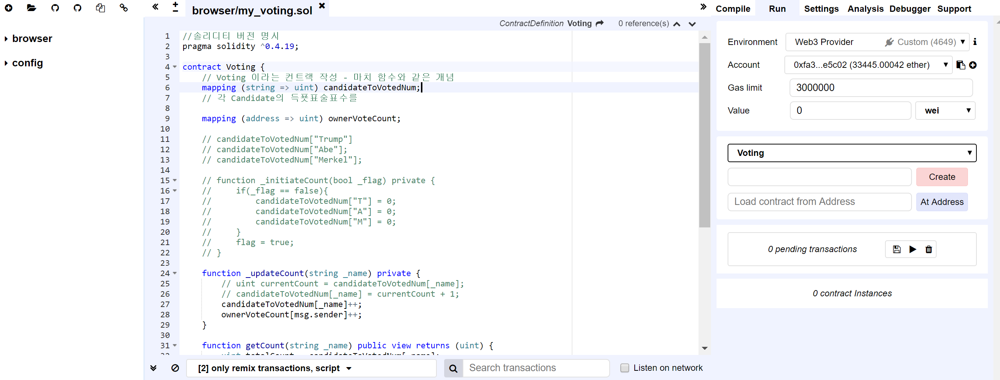
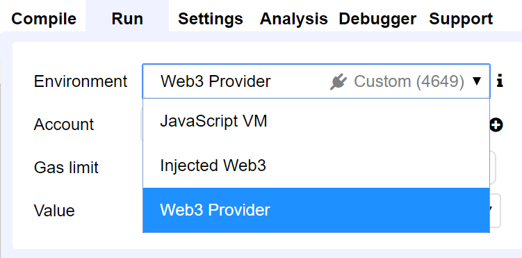

# 180507

## Trobule Shooting 1
몇일 쉬었다가 다시 블록체인 프로젝트를 시작하려 했더니... Remix 브라우저에서 알수없는 오류가...
Remix란 Solidity로 Smart Contract를 개발할 수 있는 온라인 IDE이다. 

이렇게 생겨먹은 녀석인데, 마치 다른 IDE 사용하듯이 여기에서 컨트랙트 작성 및 컴파일 및 배포 모두 가능하다.
컴파일 하고 배포하기 위한 환경으로 다음과 같은 세가지 환경에서 실행 가능하다.

나는 개발환경 구축을 이렇게했다. 클라우드 서비스인 Azure에다가 리눅스 Ubuntu VM 하나 만들고 그 위에 Ethereum 설치하여 Private 이더리움 네트워크 구축하고, Geth 실행시킨뒤 8545 포트로 열어서 거기에 접속하는 것이다. 
Azure 계정에 돈이 넉넉치 않으니 실습할때만 VM을 잠깐 켜고 해야한다.. 그래서 VM을 다시 켜고 리믹스 브라우저에서 접속하려하니 알수 없는 오류가 뜨는 것이당 ㅠㅠ **Not possible to connect to the Web3 provider. Make sure the provider is running and a connection is open (via IPC or RPC).** 이런 오류..
구글링해보니 다음과 같은 해결책을 찾았다.
* [https://github.com/ethereum/remix/issues/588](https://github.com/ethereum/remix/issues/588)
IDE를 Https로 쓰면서 http로 접속하려면 안된다는 말인듯. 그래서 현재 리믹스 브라우저 창이 https로 접속되어있었는데 http로 바꿔주었다. 끝... Happy Coding! 

